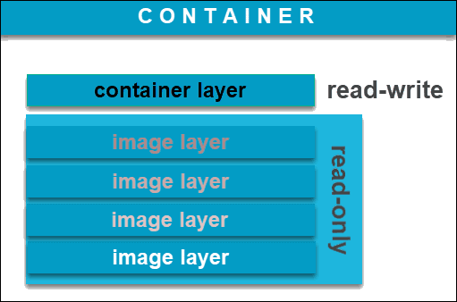

Image vs Container 镜像 vs 容器
===================================

image镜像
-----------

- Docker image是一个 ``read-only`` 文件
- 这个文件包含文件系统，源码，库文件，依赖，工具等一些运行application所需要的文件
- 可以理解成一个模板
- docker image具有分层的概念

container容器
--------------------

- “一个运行中的docker image”
- 实质是复制image并在image最上层加上一层 ``read-write`` 的层 （称之为 ``container layer`` ,容器层）
- 基于同一个image可以创建多个container

docker image的获取
----------------------

- 自己制作
- 从registry拉取（比如docker hub）

