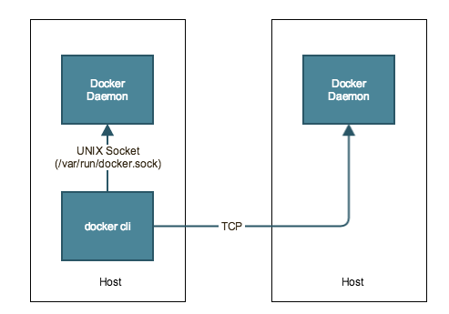

Docker Daemon的Unix Socket和TCP Socket
============================================

因为有不少同学问及Docker Daemon(dockerd) 和 docker.sock, 所以这里就通过这篇文章再给大家解释一下。

关于socket
-------------

Docker是CS架构，客户端（也就是Docker的CLI）和服务器端（也就是dockerd）进行通信的方式有两种：

- 单机默认情况是通过Unix socket （IPC，是通过文件进行通信的）
- 多机情况下（比如Docker客户端和dockerd不在一台机器上），那就可以打开TCP socket，通过网络进行通信

Unix Socket
-----------------

至于为什么默认使用Unix socket，关闭TCP socket，原因主要是为了安全。Unix socket是文件系统里的一个文件，在Linux中，文件是很容易
通过设置权限来做访问控制的，当我们启动了dockerd进程后，会在 ``/var/run`` 目录下产生一些文件，其中有一个文件是 ``docker.sock`` ,
这个文件的权限是root权限，docker这个group的。

.. code-block:: bash

    $  run pwd
    /var/run
    $  run ls
    WSL  lock  mount  resolvconf  shm  sudo  user
    $  run sudo service docker start
    * Starting Docker: docker                                                                                       [ OK ]
    $  run ls
    WSL  docker  docker-ssd.pid  docker.pid  docker.sock  lock  mount  resolvconf  shm  sudo  user  xtables.lock
    $  run ls -l | grep docker
    drwx------ 6 root root   160 Aug 13 13:10 docker
    -rw-r--r-- 1 root root     4 Aug 13 13:10 docker-ssd.pid
    -rw-r--r-- 1 root root     3 Aug 13 13:10 docker.pid
    srw-rw---- 1 root docker   0 Aug 13 13:10 docker.sock

这就是为什么我们在使用docker命令的时候，需要加 ``sudo`` 或者把当前用户添加到 docker这个组里。

.. code-block:: bash

    sudo gpasswd -a $USER docker
    sudo service docker restart

docker.sock的一个小实验
-------------------------

任何能读取docker.sock文件的程序，实际上就能通过docker客户端做所有docker命令能做的事情，利用这个特点我们可以做一些有趣但某些场景可能很
有用的事情。

比如现在有一个container

.. code-block:: bash

    ➜  ~ docker container run -d -p 8080:80 nginx
    7ef76822c12f4ebd66eb24ca50e8848df0da5110ffc1c32753342daf96eb203e
    ➜  ~
    ➜  ~ docker container ps
    CONTAINER ID   IMAGE     COMMAND                  CREATED         STATUS         PORTS                                   NAMES
    7ef76822c12f   nginx     "/docker-entrypoint.…"   5 seconds ago   Up 4 seconds   0.0.0.0:8080->80/tcp, :::8080->80/tcp   vibrant_vaughan
    ➜  ~

我们可以再创建一个container，把本地的 ``docker.sock`` 文件给mount进去, 只要这个container里安装了docker客户端，那它就能访问到这个文件，
从而做任何我们在宿主机上docker命令可以做的事情。

拉取一个安装了docker客户端的镜像

.. code-block:: bash

    docker pull docker

创建容器并加载 docker.sock文件。这时候我们在这个容器里就可以运行docker命令了，比如创建容器，而且这个容器是创建在了宿主机上，而不是这个container里。

.. code-block:: bash

    ➜  ~ docker container run --rm -it -v /var/run/docker.sock:/var/run/docker.sock docker:latest sh
    / #
    / #
    / # docker container ps
    CONTAINER ID   IMAGE           COMMAND                  CREATED          STATUS          PORTS                                   NAMES
    3e72e6a9563d   docker:latest   "docker-entrypoint.s…"   14 seconds ago   Up 14 seconds                                           tender_kilby
    7ef76822c12f   nginx           "/docker-entrypoint.…"   4 minutes ago    Up 4 minutes    0.0.0.0:8080->80/tcp, :::8080->80/tcp   vibrant_vaughan
    / #
    
    / # docker container run --rm -d busybox:latest ping 1.1.1.1
    b250c29051e51cb429e15471ed301c0806a29cef1ffbf388c46861a7f538f4f9
    / #
    / # docker container ls
    CONTAINER ID   IMAGE            COMMAND                  CREATED              STATUS              PORTS                                   NAMES
    b250c29051e5   busybox:latest   "ping 1.1.1.1"           4 seconds ago        Up 4 seconds                                                stoic_agnesi
    3e72e6a9563d   docker:latest    "docker-entrypoint.s…"   About a minute ago   Up About a minute                                           tender_kilby
    7ef76822c12f   nginx            "/docker-entrypoint.…"   5 minutes ago        Up 5 minutes        0.0.0.0:8080->80/tcp, :::8080->80/tcp   vibrant_vaughan
    / #
    / # exit
    ➜  ~
    ➜  ~ docker container ls
    CONTAINER ID   IMAGE            COMMAND                  CREATED          STATUS         PORTS                                   NAMES
    b250c29051e5   busybox:latest   "ping 1.1.1.1"           10 seconds ago   Up 9 seconds                                           stoic_agnesi
    7ef76822c12f   nginx            "/docker-entrypoint.…"   5 minutes ago    Up 5 minutes   0.0.0.0:8080->80/tcp, :::8080->80/tcp   vibrant_vaughan
    ➜  ~

像这种模式一般用于 本地容器的监控，log采集等，因为它有这个全局的视角，只要在这个容器里安装好相应的程序就可以了。

TCP Socket
-------------

但是有些情况下，我们想使用本地的docker客户端去访问远程的dockerd，这时候就需要打开TCP socket了，通过IP + 端口的形式对外提供服务。
如果要打开TCP socket，则可以通过下面类似的命令实现

.. code-block:: bash

    # listen using the default unix socket, and on 2 specific IP addresses on this host.

    $ sudo dockerd -H unix:///var/run/docker.sock -H tcp://192.168.59.106 -H tcp://10.10.10.2

然后在客户端设置一下docker host的位置就可以了（默认端口是2375）

.. code-block:: bash

    $ export DOCKER_HOST="tcp://0.0.0.0:2375"
    $ docker ps

具体可参考 https://docs.docker.com/engine/reference/commandline/dockerd/

至于安全性，大家就非常清楚了，任何人只要能访问到你的IP和端口，那就能连接你的dockerd，做任何你本地能做的事情。

最后希望本文能帮助到大家，哪怕一点点。