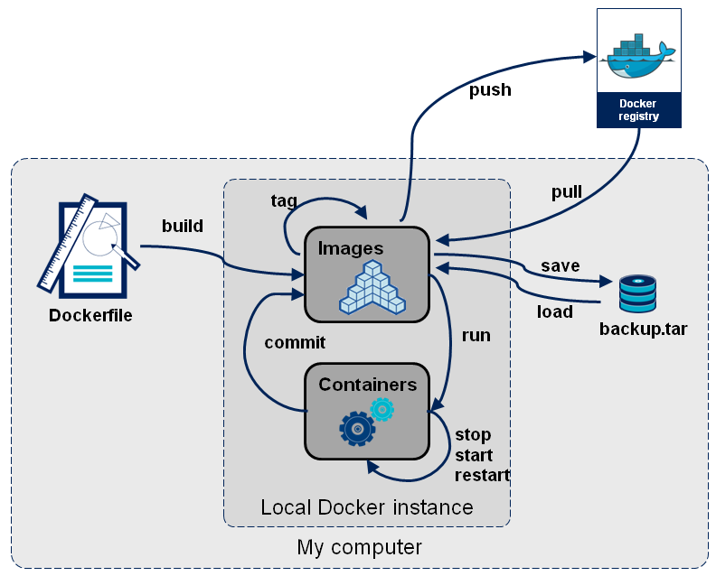

镜像的获取
==================

- pull from ``registry`` (online) 从registry拉取
  
  * public（公有）
  * private（私有）

- build from ``Dockerfile`` (online) 从Dockerfile构建
- load from ``file`` (offline) 文件导入 （离线）

