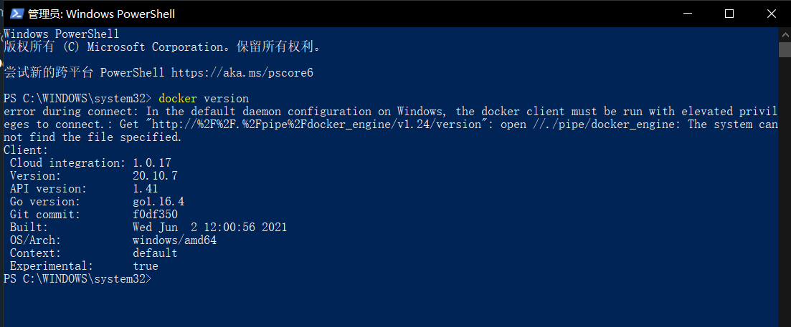

本节常见问题
===============

以下问题是从大家提问的问题筛选出来的常见问题。

1. windows 10 家庭版能装 Hyper-v 么？
--------------------------------------

答案是官方不支持，但是民间有一些方式可以尝试（本人没有经过验证，请大家自行斟酌，本人对产生的后果一概不负责）

https://www.itechtics.com/enable-hyper-v-windows-10-home/ （英文）

个人建议：

- 升级到 ``windows pro``
- 不用 ``hyper-v`` ，使用 ``virtualbox`` 或者 ``vmware`` 来创建Linux虚拟机

2. docker 在 windows 上启动失败，the docker client must be run with elevated privileges to connect
------------------------------------------------------------------------------------------------------

管理员方式执行cmd命令  

.. code-block:: powershell

    netsh winsock reset  