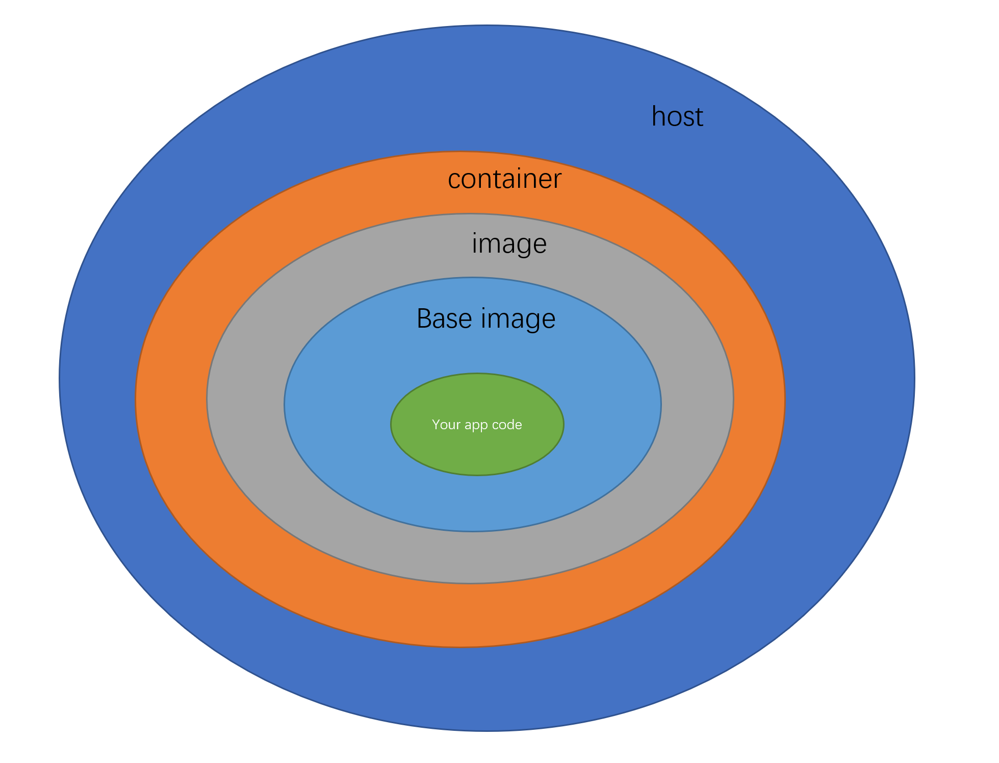

容器安全
============

app
--------

代码层面的漏洞

镜像
------------

- 选择官方认证的基础镜像
- 镜像的漏洞扫描

容器
------

- 容器的漏洞扫描
- 容器的实时监控

主机
--------

- Linux Kernel 
- Kernel namespaces
- Control groups

https://www.cvedetails.com/vulnerability-list/vendor_id-33/product_id-47/year-2021/Linux-Linux-Kernel.html

dockerd的rootless模式

