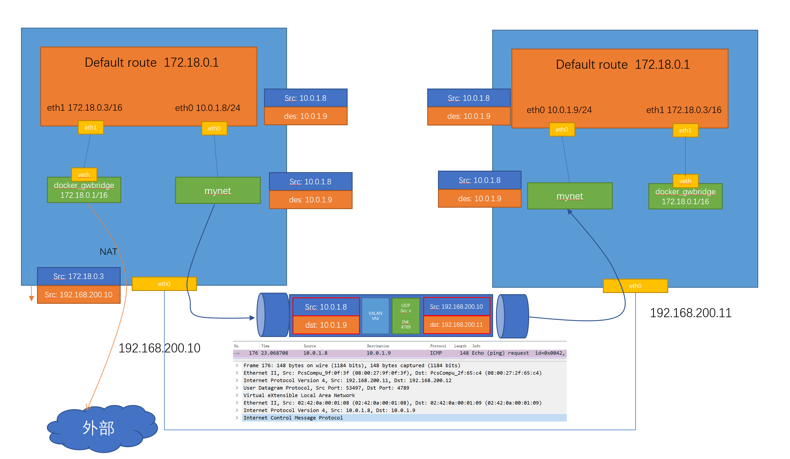

Swarm 的 overlay 网络详解
==============================

对于理解swarm的网络来讲，个人认为最重要的两个点：

- 第一是外部如何访问部署运行在swarm集群内的服务，可以称之为 ``入方向`` 流量，在swarm里我们通过 ``ingress`` 来解决
- 第二是部署在swarm集群里的服务，如何对外进行访问，这部分又分为两块:
  
  - 第一，``东西向流量`` ，也就是不同swarm节点上的容器之间如何通信，swarm通过 ``overlay`` 网络来解决；
  - 第二，``南北向流量`` ，也就是swarm集群里的容器如何对外访问，比如互联网，这个是 ``Linux bridge + iptables NAT`` 来解决的

创建 overlay 网络
----------------------

.. code-block:: bash

    vagrant@swarm-manager:~$ docker network create -d overlay mynet

这个网络会同步到所有的swarm节点上

创建服务
----------

创建一个服务连接到这个 overlay网络， name 是 test ， replicas 是 2

.. code-block:: bash

    vagrant@swarm-manager:~$ docker service create --network mynet --name test --replicas 2 busybox ping 8.8.8.8
    vagrant@swarm-manager:~$ docker service ps test
    ID             NAME      IMAGE            NODE            DESIRED STATE   CURRENT STATE            ERROR     PORTS
    yf5uqm1kzx6d   test.1    busybox:latest   swarm-worker1   Running         Running 18 seconds ago
    3tmp4cdqfs8a   test.2    busybox:latest   swarm-worker2   Running         Running 18 seconds ago

可以看到这两个容器分别被创建在worker1和worker2两个节点上

网络查看
------------

到worker1和worker2上分别查看容器的网络连接情况

.. code-block:: bash

    vagrant@swarm-worker1:~$ docker container ls
    CONTAINER ID   IMAGE            COMMAND          CREATED      STATUS      PORTS     NAMES
    cac4be28ced7   busybox:latest   "ping 8.8.8.8"   2 days ago   Up 2 days             test.1.yf5uqm1kzx6dbt7n26e4akhsu
    vagrant@swarm-worker1:~$ docker container exec -it cac sh
    / # ip a
    1: lo: <LOOPBACK,UP,LOWER_UP> mtu 65536 qdisc noqueue qlen 1000
        link/loopback 00:00:00:00:00:00 brd 00:00:00:00:00:00
        inet 127.0.0.1/8 scope host lo
        valid_lft forever preferred_lft forever
    24: eth0@if25: <BROADCAST,MULTICAST,UP,LOWER_UP,M-DOWN> mtu 1450 qdisc noqueue
        link/ether 02:42:0a:00:01:08 brd ff:ff:ff:ff:ff:ff
        inet 10.0.1.8/24 brd 10.0.1.255 scope global eth0
        valid_lft forever preferred_lft forever
    26: eth1@if27: <BROADCAST,MULTICAST,UP,LOWER_UP,M-DOWN> mtu 1500 qdisc noqueue
        link/ether 02:42:ac:12:00:03 brd ff:ff:ff:ff:ff:ff
        inet 172.18.0.3/16 brd 172.18.255.255 scope global eth1
        valid_lft forever preferred_lft forever
    / #

这个容器有两个接口 eth0和eth1， 其中eth0是连到了mynet这个网络，eth1是连到docker_gwbridge这个网络

.. code-block:: bash

    vagrant@swarm-worker1:~$ docker network ls
    NETWORK ID     NAME              DRIVER    SCOPE
    a631a4e0b63c   bridge            bridge    local
    56945463a582   docker_gwbridge   bridge    local
    9bdfcae84f94   host              host      local
    14fy2l7a4mci   ingress           overlay   swarm
    lpirdge00y3j   mynet             overlay   swarm
    c1837f1284f8   none              null      local

在这个容器里是可以直接ping通worker2上容器的IP 10.0.1.9的

