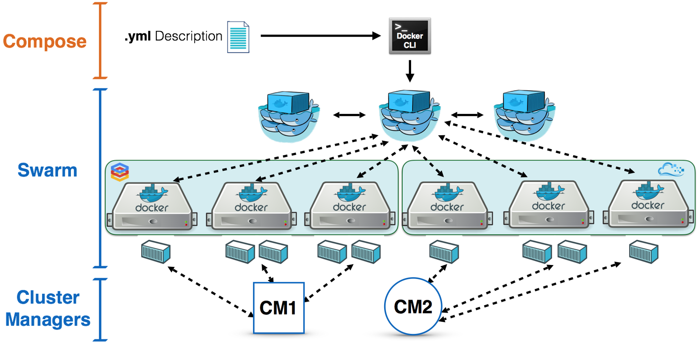
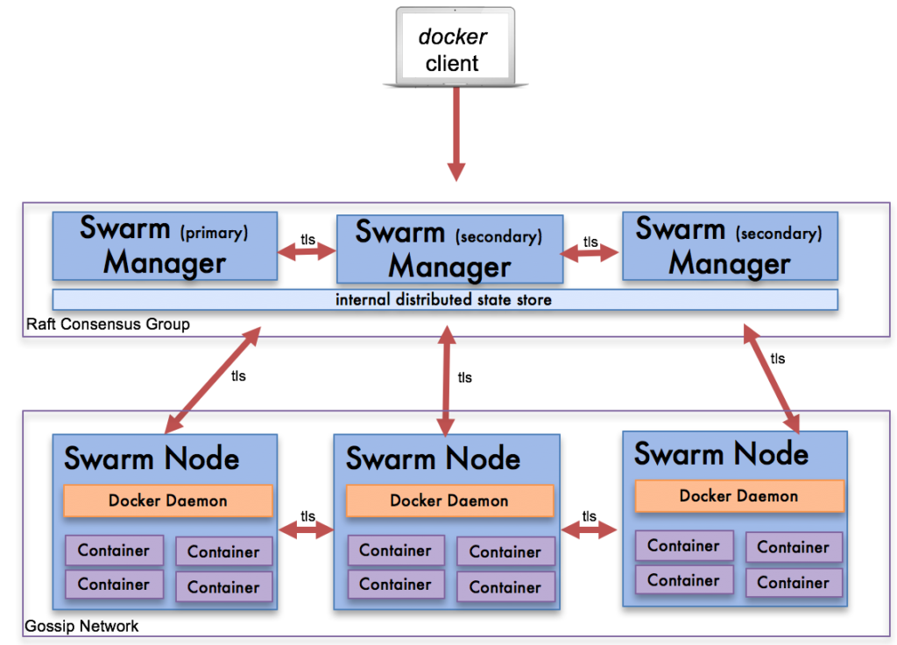

docker swarm 介绍
=======================

为什么不建议在生产环境中使用docker-Compose
---------------------------------------------

- 多机器如何管理？
- 如果跨机器做scale横向扩展？
- 容器失败退出时如何新建容器确保服务正常运行？
- 如何确保零宕机时间？
- 如何管理密码，Key等敏感数据？
- 其它

容器编排 swarm
---------------------

Swarm的基本架构

docker swarm vs kubernetes
------------------------------

k8s在容器编排领域处于绝对领先的地位 

2021年redhat调查https://www.redhat.com/en/resources/kubernetes-adoption-security-market-trends-2021-overview

.. image:: ../_static/docker-swarm/k8s_vs_swarm.png
    :alt: docker-swarm-k8s

为什么还要学些了解docker swarm呢？