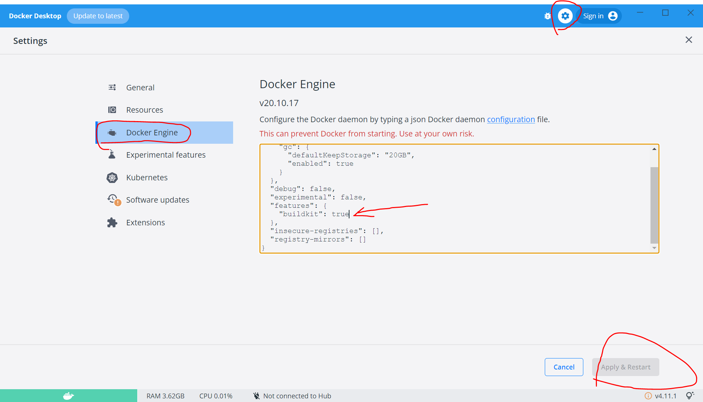
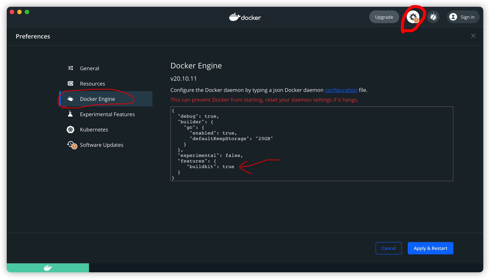

Buildkit
==================

Buildkit这个feature能够提高build的效率。

https://docs.docker.com/develop/develop-images/build_enhancements/

Windows
----------

查看是否激活了Buildkit

如果没有，请添加

.. code-block:: json

  "features": {
    "buildkit": true
  }

然后 ``Apply & Restart``

Mac
-------

查看是否激活了Buildkit

如果没有，请添加

.. code-block:: json

  "features": {
    "buildkit": true
  }

Linux
-----------

在 ``/etc/docker/daemon.json`` 里添加（如果没有这个文件，则新建）, 然后重启docker

.. code-block:: json

    { "features": { "buildkit": true } }

或者在执行docker build命令时设置

.. code-block:: bash

    $ DOCKER_BUILDKIT=1 docker build .