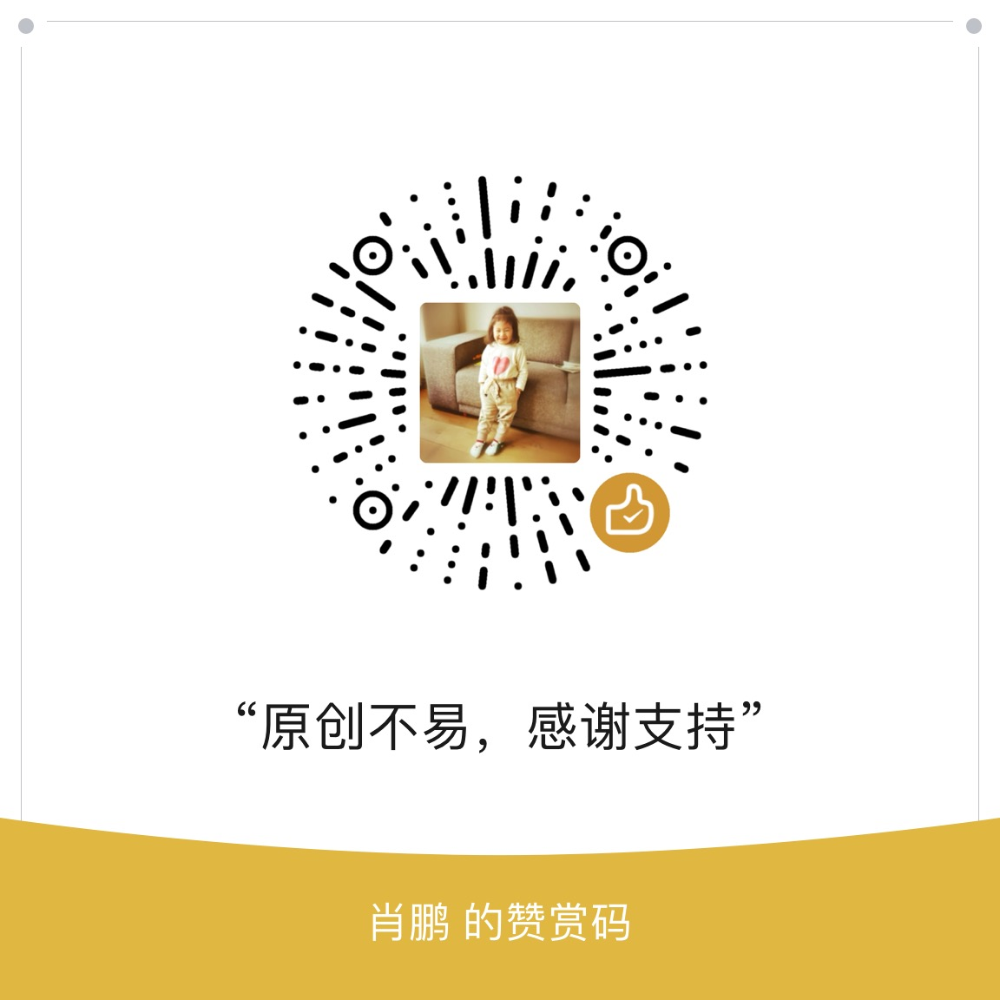
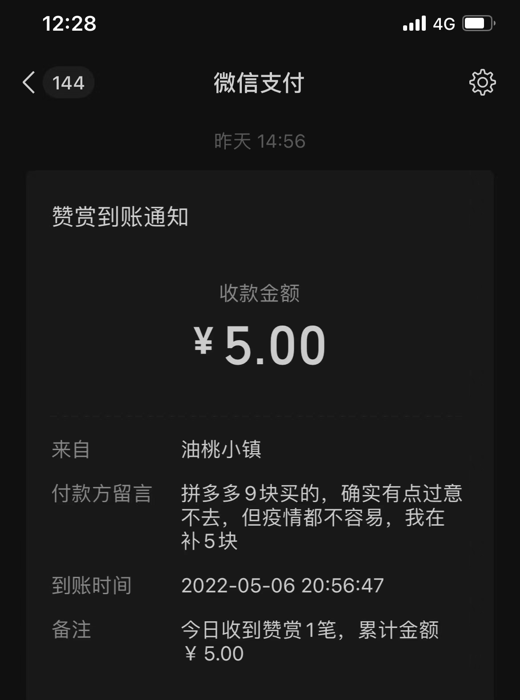
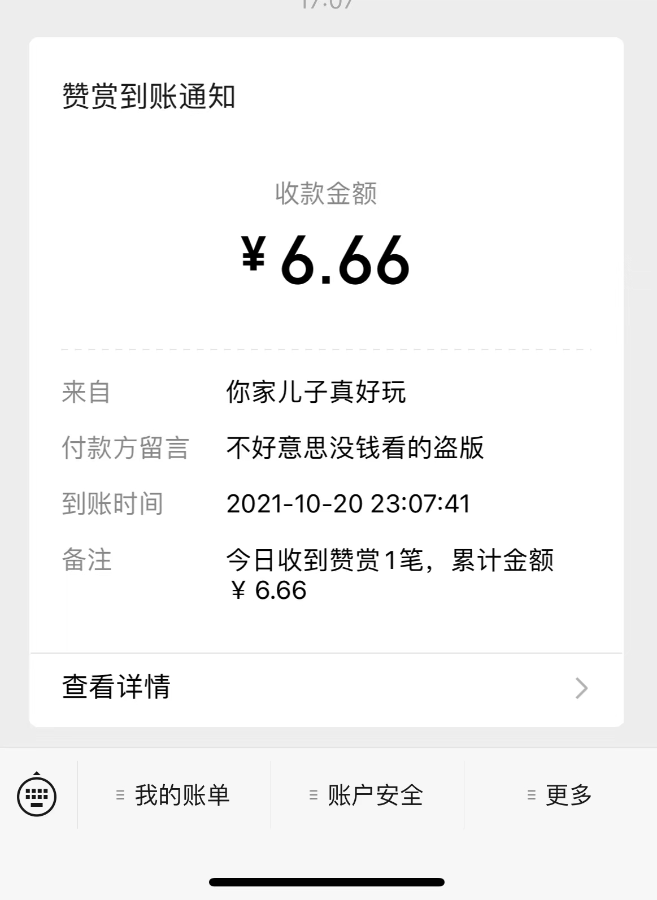
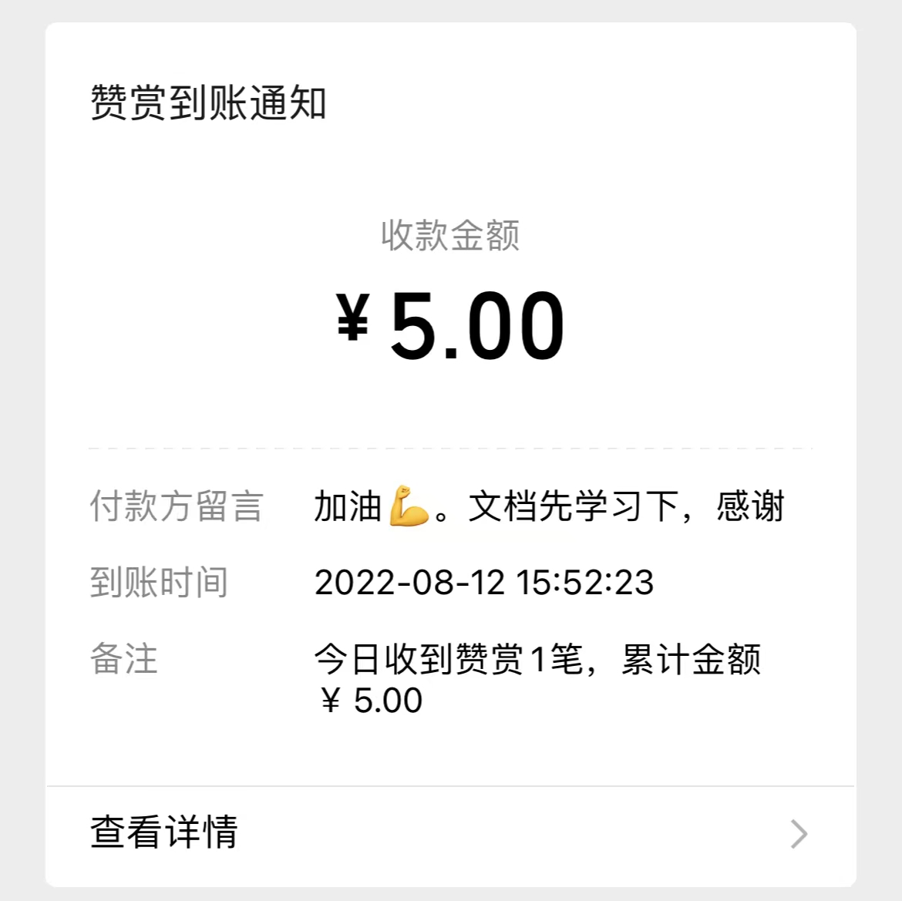
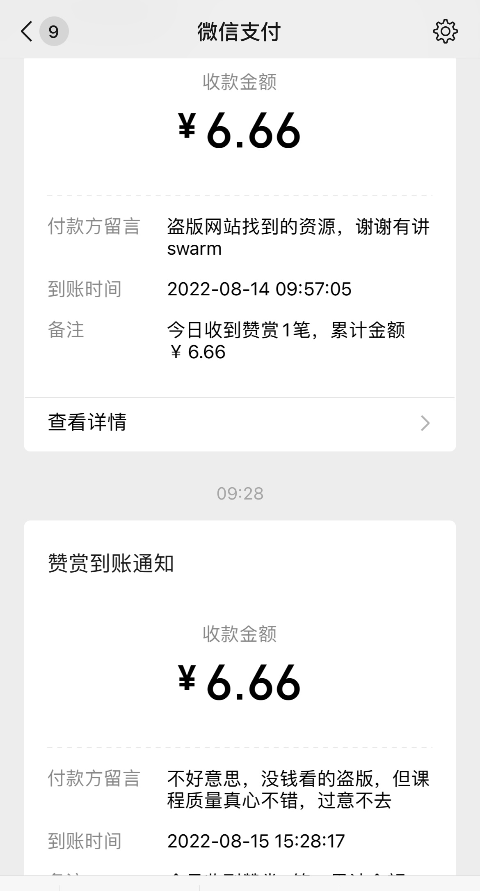
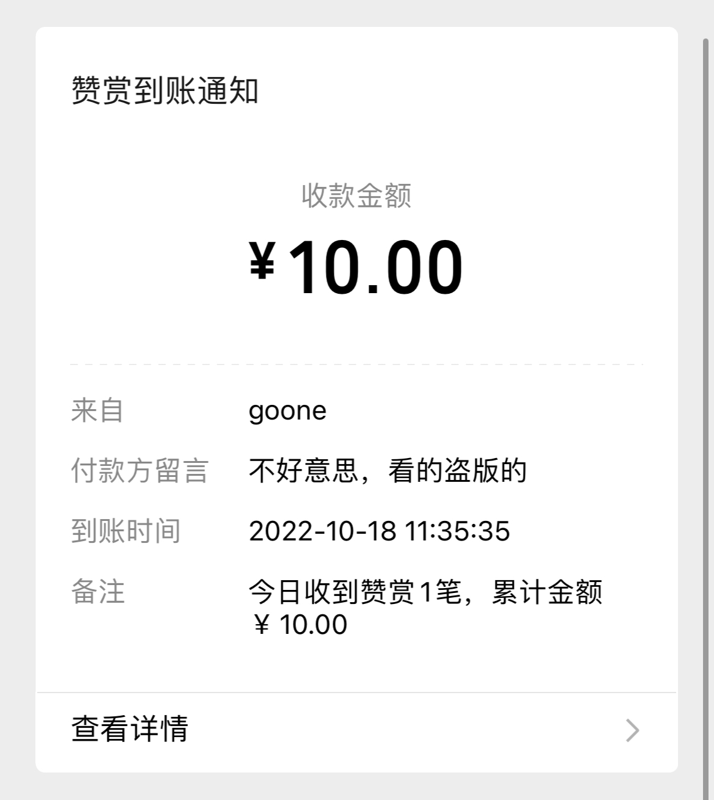

.. Docker Tips documentation master file, created by
   sphinx-quickstart on Fri May 14 11:29:29 2021.
   You can adapt this file completely to your liking, but it should at least
   contain the root `toctree` directive.

Docker Tips (Docker笔记)
=======================================

.. warning::

   请大家支持正版。大家的支持才是我录制和更新课程的动力

.. note::

   此站的永久域名是 https://www.docker.tips 欢迎收藏
   
.. note::

   本人同时推出课程《Certified Kubernetes Administrator (CKA) 考试完全指南（2022版）》。课程购买地址 https://www.udemy.com/course/k8s-chinese/?referralCode=4D8B7AFDBFAF9A8E4F81

.. note::

   有购买了盗版或者白嫖的同学，如果过意不去也可以给我打赏，或者单纯为了感谢，金额随意。

.. toctree::
   :maxdepth: 2
   :caption: 目录:

   docker-install
   container-quickstart
   docker-image
   dockerfile-guide
   docker-volume
   single-host-network
   docker-compose
   docker-swarm
   docker-podman
   docker-arch
   docker-cicd
   docker-security
   docker-blog
   about

Indices and tables
==================

* :ref:`genindex`
* :ref:`modindex`
* :ref:`search`
