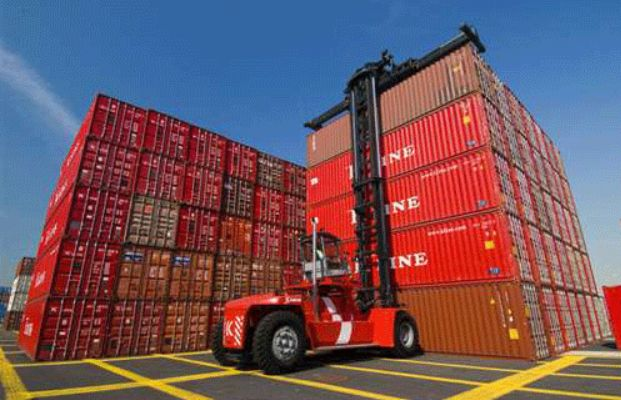

容器技术的介绍
==============

.. note::
    注意我们这里所说的容器container是指的一种技术，而Docker只是一个容器技术的实现，或者说让容器技术普及开来的最成功的实现

容器正在引领基础架构的一场新的革命
----------------------------------

- 90年代的PC
- 00年代的虚拟化
- 10年代的cloud
- 11年代的container
    
    
什么是container(容器）？
----------------------------

容器是一种快速的打包技术

Package Software into Standardized Units for Development, Shipment and Deployment

- 标准化
- 轻量级
- 易移植

Linux Container容器技术的诞生（2008年）就解决了IT世界里“集装箱运输”的问题。Linux Container（简称LXC）它是一种内核轻量级的操作系统层虚拟化技术。Linux Container主要由Namespace和Cgroup两大机制来保证实现

- Namespace命名空间主要用于资源的隔离
- Cgroup就负责资源管理控制作用，比如进程组使用CPU/MEM的限制，进程组的优先级控制，进程组的挂起和恢复等等。

.. image:: ../_static/container-what-is-container.png
    :width: 600px
    :alt: what-is-container

容器的快速发展和普及
-------------------------

.. note::
    到2020年，全球超过50%的公司将在生产环境中使用container —— Gartner

https://www.docker.com/blog/docker-index-shows-continued-massive-developer-adoption-and-activity-to-build-and-share-apps-with-docker/

.. image:: ../_static/dockerhub-2020.png
    :width: 600px
    :alt: dockerhub2020

容器的标准化
-------------

``docker != container`` 

在2015年，由Google，Docker、红帽等厂商联合发起了OCI（Open Container Initiative）组织，致力于容器技术的标准化

容器运行时标准 （runtime spec）
~~~~~~~~~~~~~~~~~~~~~~~~~~~~~~~~~~

简单来讲就是规定了容器的基本操作规范，比如如何下载镜像，创建容器，启动容器等。

容器镜像标准（image spec）
~~~~~~~~~~~~~~~~~~~~~~~~~~~

主要定义镜像的基本格式。

容器是关乎“速度”
------------------

- 容器会加速你的软件开发
- 容器会加速你的程序编译和构建
- 容器会加速你的测试
- 容器会速度你的部署
- 容器会加速你的更新
- 容器会速度你的故障恢复
