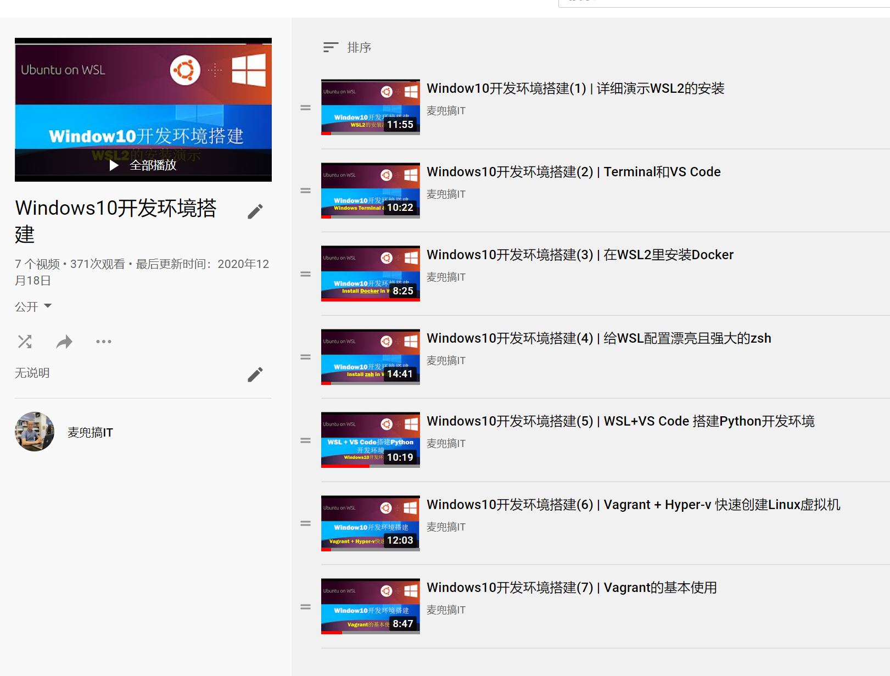

安装 Windows10 WSL2 环境和 Docker
===================================

如果大家使用Windows10的话，比较建议大家安装WSL2

我在Youtube和B站上有相关的系列视频，感兴趣的可以观看(观看地址在下面)

Windows10 WSL2环境的搭建系列视频

youtube
----------

`Windows10开发环境搭建(YouTube) <https://www.youtube.com/playlist?list=PLfQqWeOCIH4ACS0037k1KLNIv5f646jbr>`_

B站
------

`Windows10开发环境搭建(B站) <https://space.bilibili.com/364122352/channel/detail?cid=166238>`_
