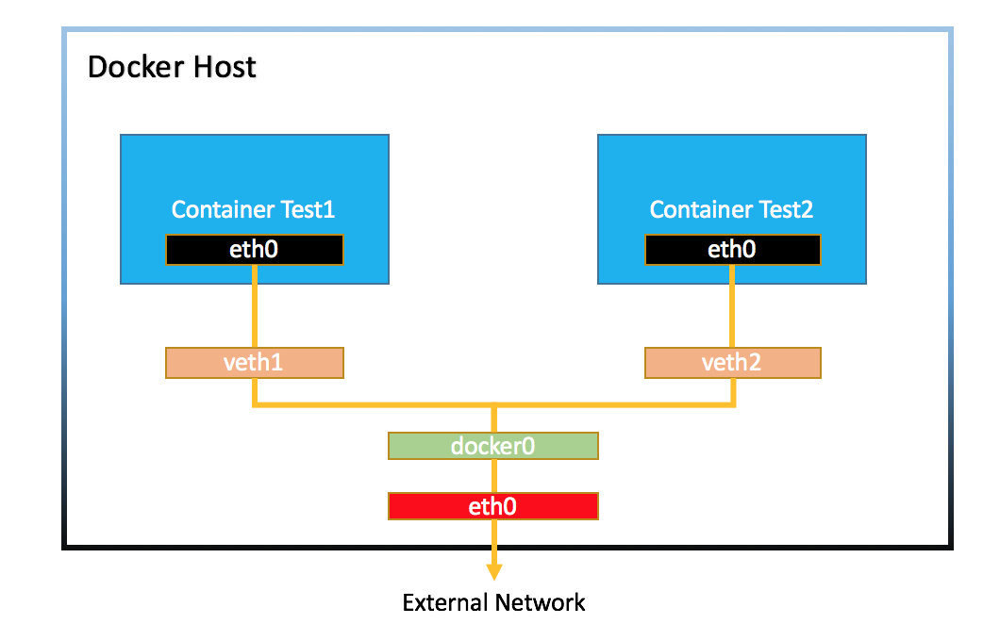

Docker Bridge 网络
=======================

.. warning::

    注意，本节实验需要在Linux环境下进行

创建两个容器
----------------

.. code-block:: bash

    $ docker container run -d --rm --name box1 busybox /bin/sh -c "while true; do sleep 3600; done"
    $ docker container run -d --rm --name box2 busybox /bin/sh -c "while true; do sleep 3600; done"
    $ docker container ls
    CONTAINER ID   IMAGE     COMMAND                  CREATED          STATUS          PORTS     NAMES
    4f3303c84e53   busybox   "/bin/sh -c 'while t…"   49 minutes ago   Up 49 minutes             box2
    03494b034694   busybox   "/bin/sh -c 'while t…"   49 minutes ago   Up 49 minutes             box1

容器间通信
------------

两个容器都连接到了一个叫 docker0 的Linux bridge上

.. code-block:: bash

    $ docker network ls
    NETWORK ID     NAME      DRIVER    SCOPE
    1847e179a316   bridge    bridge    local
    a647a4ad0b4f   host      host      local
    fbd81b56c009   none      null      local
    $ docker network inspect bridge
    [
        {
            "Name": "bridge",
            "Id": "1847e179a316ee5219c951c2c21cf2c787d431d1ffb3ef621b8f0d1edd197b24",
            "Created": "2021-07-01T15:28:09.265408946Z",
            "Scope": "local",
            "Driver": "bridge",
            "EnableIPv6": false,
            "IPAM": {
                "Driver": "default",
                "Options": null,
                "Config": [
                    {
                        "Subnet": "172.17.0.0/16",
                        "Gateway": "172.17.0.1"
                    }
                ]
            },
            "Internal": false,
            "Attachable": false,
            "Ingress": false,
            "ConfigFrom": {
                "Network": ""
            },
            "ConfigOnly": false,
            "Containers": {
                "03494b034694982fa085cc4052b6c7b8b9c046f9d5f85f30e3a9e716fad20741": {
                    "Name": "box1",
                    "EndpointID": "072160448becebb7c9c333dce9bbdf7601a92b1d3e7a5820b8b35976cf4fd6ff",
                    "MacAddress": "02:42:ac:11:00:02",
                    "IPv4Address": "172.17.0.2/16",
                    "IPv6Address": ""
                },
                "4f3303c84e5391ea37db664fd08683b01decdadae636aaa1bfd7bb9669cbd8de": {
                    "Name": "box2",
                    "EndpointID": "4cf0f635d4273066acd3075ec775e6fa405034f94b88c1bcacdaae847612f2c5",
                    "MacAddress": "02:42:ac:11:00:03",
                    "IPv4Address": "172.17.0.3/16",
                    "IPv6Address": ""
                }
            },
            "Options": {
                "com.docker.network.bridge.default_bridge": "true",
                "com.docker.network.bridge.enable_icc": "true",
                "com.docker.network.bridge.enable_ip_masquerade": "true",
                "com.docker.network.bridge.host_binding_ipv4": "0.0.0.0",
                "com.docker.network.bridge.name": "docker0",
                "com.docker.network.driver.mtu": "1500"
            },
            "Labels": {}
        }
    ]

.. note::

    ``brctl`` 使用前需要安装, 对于CentOS, 可以通过 ``sudo yum install -y bridge-utils`` 安装. 对于Ubuntu, 可以通过 ``sudo apt-get install -y bridge-utils``

.. code-block:: bash

    $ brctl show
    bridge name     bridge id               STP enabled     interfaces
    docker0         8000.0242759468cf       no              veth8c9bb82
                                                            vethd8f9afb

容器对外通信
--------------

查看路由

.. code-block:: bash

    $ ip route
    default via 10.0.2.2 dev eth0 proto dhcp metric 100
    10.0.2.0/24 dev eth0 proto kernel scope link src 10.0.2.15 metric 100
    172.17.0.0/16 dev docker0 proto kernel scope link src 172.17.0.1
    192.168.200.0/24 dev eth1 proto kernel scope link src 192.168.200.10 metric 101

iptable [#f4]_ 转发规则

.. code-block:: bash

    $ sudo iptables --list -t nat
    Chain PREROUTING (policy ACCEPT)
    target     prot opt source               destination
    DOCKER     all  --  anywhere             anywhere             ADDRTYPE match dst-type LOCAL

    Chain INPUT (policy ACCEPT)
    target     prot opt source               destination

    Chain OUTPUT (policy ACCEPT)
    target     prot opt source               destination
    DOCKER     all  --  anywhere            !loopback/8           ADDRTYPE match dst-type LOCAL

    Chain POSTROUTING (policy ACCEPT)
    target     prot opt source               destination
    MASQUERADE  all  --  172.17.0.0/16        anywhere

    Chain DOCKER (2 references)
    target     prot opt source               destination
    RETURN     all  --  anywhere             anywhere

端口转发
-------------

创建容器

.. code-block:: bash

    $ docker container run -d --rm --name web -p 8080:80 nginx
    $ docker container inspect --format '{{.NetworkSettings.IPAddress}}' web
    $ docker container run -d --rm --name client busybox /bin/sh -c "while true; do sleep 3600; done"
    $ docker container inspect --format '{{.NetworkSettings.IPAddress}}' client
    $ docker container exec -it client wget http://172.17.0.2

查看iptables的端口转发规则

.. code-block:: bash

    [vagrant@docker-host1 ~]$ sudo iptables -t nat -nvxL
    Chain PREROUTING (policy ACCEPT 10 packets, 1961 bytes)
        pkts      bytes target     prot opt in     out     source               destination
        1       52 DOCKER     all  --  *      *       0.0.0.0/0            0.0.0.0/0            ADDRTYPE match dst-type LOCAL

    Chain INPUT (policy ACCEPT 9 packets, 1901 bytes)
        pkts      bytes target     prot opt in     out     source               destination

    Chain OUTPUT (policy ACCEPT 2 packets, 120 bytes)
        pkts      bytes target     prot opt in     out     source               destination
        0        0 DOCKER     all  --  *      *       0.0.0.0/0           !127.0.0.0/8          ADDRTYPE match dst-type LOCAL

    Chain POSTROUTING (policy ACCEPT 4 packets, 232 bytes)
        pkts      bytes target     prot opt in     out     source               destination
        3      202 MASQUERADE  all  --  *      !docker0  172.17.0.0/16        0.0.0.0/0
        0        0 MASQUERADE  tcp  --  *      *       172.17.0.2           172.17.0.2           tcp dpt:80

    Chain DOCKER (2 references)
        pkts      bytes target     prot opt in     out     source               destination
        0        0 RETURN     all  --  docker0 *       0.0.0.0/0            0.0.0.0/0
        1       52 DNAT       tcp  --  !docker0 *       0.0.0.0/0            0.0.0.0/0            tcp dpt:8080 to:172.17.0.2:80

参考资料
--------

.. [#f4] https://access.redhat.com/documentation/en-US/Red_Hat_Enterprise_Linux/4/html/Security_Guide/s1-firewall-ipt-fwd.html