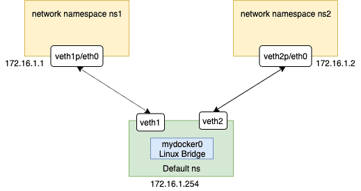

网络命名空间
==================

Linux的Namespace（命名空间）技术是一种隔离技术，常用的Namespace有 user namespace, process namespace, network namespace等

在Docker容器中，不同的容器通过Network namespace进行了隔离，也就是不同的容器有各自的IP地址，路由表等，互不影响。

.. note::

    准备一台Linux机器，这一节会用到一个叫 ``brtcl`` 的命令，这个命令需要安装，如果是Ubuntu的系统，可以通过 ``apt-get install bridge-utils`` 安装；如果是Centos系统，可以通过
    ``sudo yum install bridge-utils`` 来安装

创建bridge
-----------

.. code-block:: bash

    [vagrant@docker-host1 ~]$ sudo brctl addbr mydocker0
    [vagrant@docker-host1 ~]$ brctl show
    bridge name     bridge id               STP enabled     interfaces
    mydocker0               8000.000000000000       no
    [vagrant@docker-host1 ~]$

准备一个shell脚本
-------------------

.. note::

    https://twitter.com/xiaopeng163/status/1531022226933391362?s=20&t=LuWDZHV3TCLmLsI1nCb1FQ

脚本名字叫 ``add-ns-to-br.sh``

.. code-block:: bash

    #!/bin/bash

    bridge=$1
    namespace=$2
    addr=$3

    vethA=veth-$namespace
    vethB=eth00-$namespace

    sudo ip netns add $namespace
    sudo ip link add $vethA type veth peer name $vethB

    sudo ip link set $vethB netns $namespace
    sudo ip netns exec $namespace ip addr add $addr dev $vethB
    sudo ip netns exec $namespace ip link set $vethB up

    sudo ip link set $vethA up

    sudo brctl addif $bridge $vethA

脚本执行
------------

.. code-block:: bash

    [vagrant@docker-host1 ~]$ sh add-ns-to-br.sh mydocker0 ns1 172.16.1.1/16
    [vagrant@docker-host1 ~]$ sh add-ns-to-br.sh mydocker0 ns2 172.16.1.2/16

把mydocker0这个bridge up起来

.. code-block:: bash

    [vagrant@docker-host1 ~]$ sudo ip link set dev mydocker0 up

验证
-----------

.. code-block:: bash

    [vagrant@docker-host1 ~]$ sudo ip netns exec ns1 bash
    [root@docker-host1 vagrant]# ip a
    1: lo: <LOOPBACK> mtu 65536 qdisc noop state DOWN group default qlen 1000
        link/loopback 00:00:00:00:00:00 brd 00:00:00:00:00:00
    5: eth00@if6: <BROADCAST,MULTICAST,UP,LOWER_UP> mtu 1500 qdisc noqueue state UP group default qlen 1000
        link/ether f2:59:19:34:73:70 brd ff:ff:ff:ff:ff:ff link-netnsid 0
        inet 172.16.1.1/16 scope global eth00
        valid_lft forever preferred_lft forever
        inet6 fe80::f059:19ff:fe34:7370/64 scope link
        valid_lft forever preferred_lft forever
    [root@docker-host1 vagrant]# ping 172.16.1.2
    PING 172.16.1.2 (172.16.1.2) 56(84) bytes of data.
    64 bytes from 172.16.1.2: icmp_seq=1 ttl=64 time=0.029 ms
    64 bytes from 172.16.1.2: icmp_seq=2 ttl=64 time=0.080 ms
    ^C
    --- 172.16.1.2 ping statistics ---
    2 packets transmitted, 2 received, 0% packet loss, time 1000ms
    rtt min/avg/max/mdev = 0.029/0.054/0.080/0.026 ms
    [root@docker-host1 vagrant]#

对外通信
---------

https://www.karlrupp.net/en/computer/nat_tutorial
